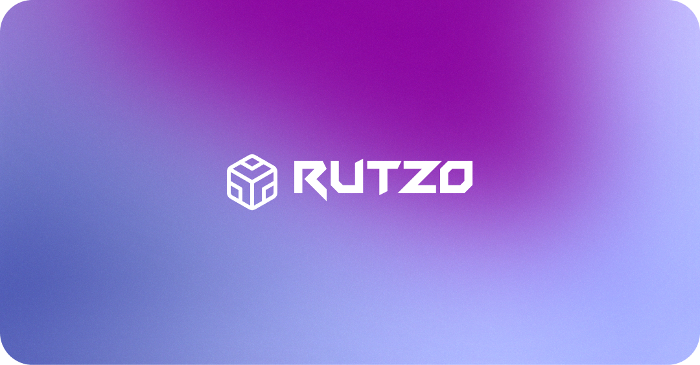

  

## Description

Rutzo is a Web3 game that allows users to earn NFTs by competing against other users through the use of NFTs as skill cards and items. The game is based on blockchain technology and uses the Vara proof-of-stake network.

## Our team

- [Ricardo Mora](https://github.com/RicardoUMC)
- [David Hernández](https://github.com/David-HernandezM)
- [Juan M. Hernández](https://github.com/JuanH44)
- [Alan Gómez](https://github.com/Alangh0011)
- [Brandon Herrera](https://github.com/brandonhxrr)